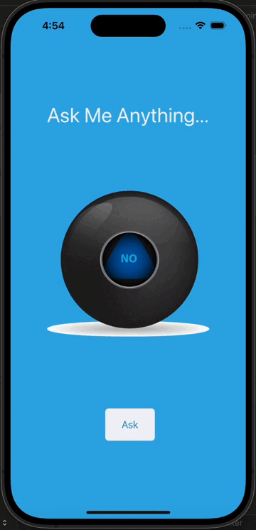

# Magic 8 Ball

## Goal

The Magic 8 Ball app is a fun and entertaining application developed using Swift. It simulates the experience of a Magic 8 Ball toy, providing users with random responses to their questions. With this app, users can seek guidance and make decisions by simply shaking their device and receiving a randomized answer from the virtual Magic 8 Ball. Key features of the app include:

## Randomized Responses 
The Magic 8 Ball app generates random responses to user questions, mimicking the unpredictable nature of the classic toy. Users can ask a question and receive an answer by shaking their device or tapping a button.

## User Interaction 
The app encourages user engagement by allowing them to interact with the virtual Magic 8 Ball. Users can input their questions and trigger the generation of a response through intuitive gestures or button taps.

## Simple and Intuitive Design 
The app features a user-friendly interface with a design reminiscent of the iconic Magic 8 Ball toy. It provides a seamless user experience, making it easy for users to ask questions and receive answers without unnecessary complexity.

## Swift Programming Language 
Developed entirely in Swift, the Magic 8 Ball app demonstrates the versatility and power of the Swift programming language for iOS app development. Swift's concise syntax and robust features enable developers to create engaging and interactive applications with ease.

